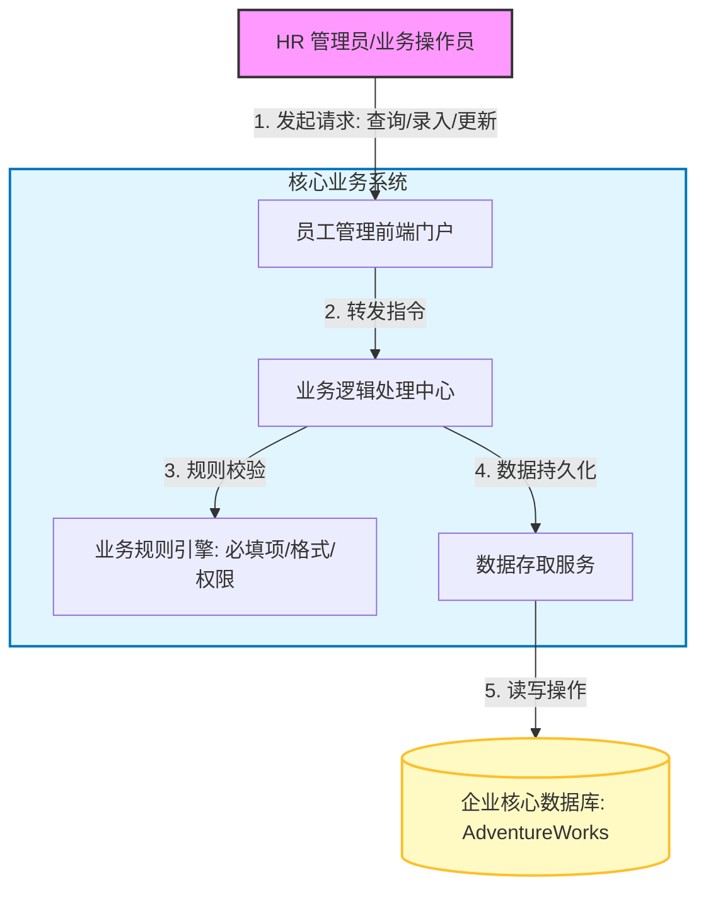
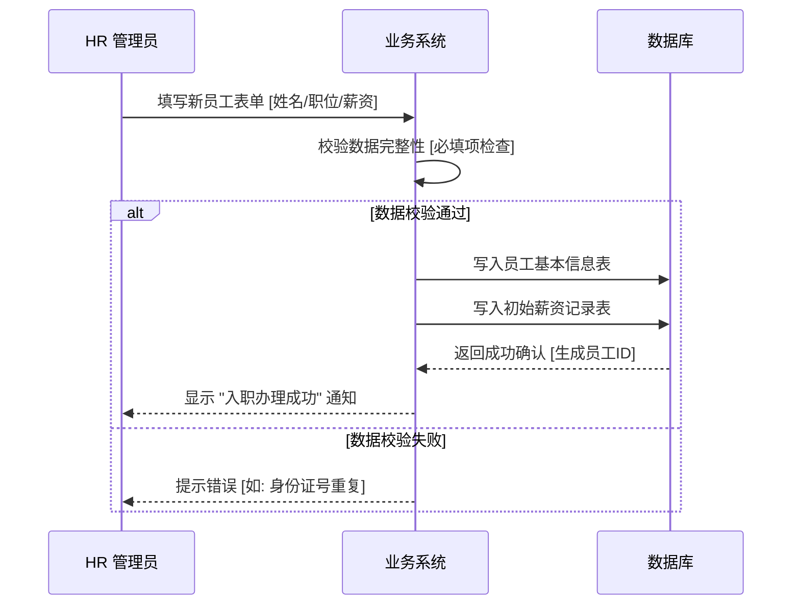

# 业务全景概览 (Business Overview)

## 1. 核心价值主张
本系统旨在为企业提供一套**轻量级、高可用的员工信息管理解决方案**。通过数字化手段，将传统的纸质人事档案转化为可检索、可追踪的在线数据资产，帮助 HR 团队实现：

*   **信息集中化**：统一管理员工基本信息、联系方式及薪资历史。
*   **流程标准化**：规范员工入职、调岗、调薪等业务操作流程。
*   **数据可追溯**：每一次薪资变动都留有历史记录，确保合规与审计需求。

---

## 2. 业务架构图 (Business Context)

下图展示了系统的核心业务边界与外部交互关系：

## 3. 核心功能模块

### 3.1 员工档案管理 (Employee Profile)
这是系统的基石，维护着每位员工的 "数字身份"。
*   **关键数据**：
    *   **身份信息**：员工 ID、登录账号 (LoginID)、身份证号 (NationalIDNumber)。
    *   **职位信息**：职位头衔 (Title)、管理者 (ManagerID)。
    *   **个人状态**：婚姻状况 (MaritalStatus)、性别 (Gender)。
*   **业务价值**：不仅是静态记录，更是企业组织架构的基础数据源。

### 3.2 薪资变更追踪 (Compensation History)
系统不仅仅记录"当前薪资"，更重要的是记录"薪资变化的时间轴"。
*   **功能点**：记录每次调薪的日期、变动后的薪资费率 (Rate)、以及支付频率 (PayFrequency)。
*   **业务价值**：为 HR 提供完整的薪资成长轨迹，便于进行薪酬分析和定薪决策。

### 3.3 高级检索与筛选 (Advanced Search)
为了应对海量员工数据，系统提供了多维度的筛选能力。
*   **筛选维度**：
    *   按 **职位头衔** 筛选 (如找出所有 "Sales Manager")
    *   按 **管理者** 筛选 (如找出 "张三" 下属的所有员工)
    *   按 **登录账号** 模糊搜索
*   **业务价值**：快速定位目标群体，提升管理效率。

---

## 4. 数据流转示意 (Data Flow High-Level)

当 HR 发起一个 "新员工入职" 动作时，数据是如何流转的？

## 5. 潜在风险与注意事项
*   **数据一致性**：修改员工信息时，需确保关联的联系人信息同步更新。
*   **并发冲突**：若多名 HR 同时修改同一员工档案，系统采用 "最后提交者胜" 或 "乐观锁" 策略（需技术侧确认具体实现）。
