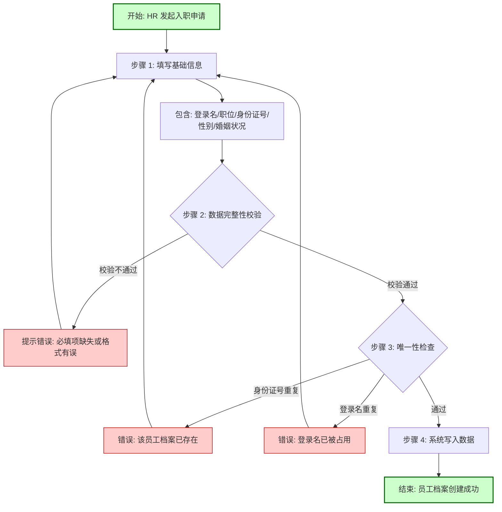
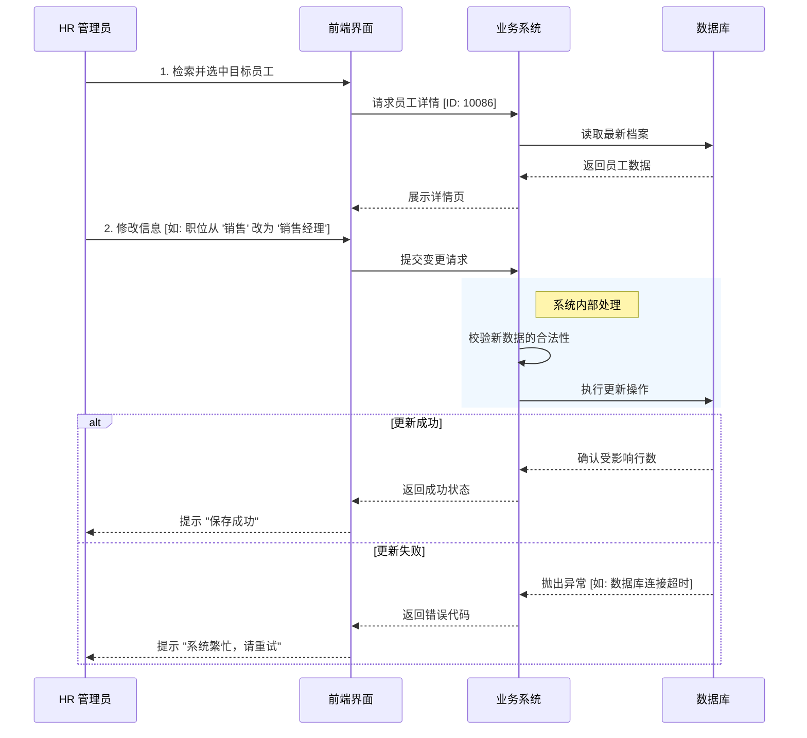
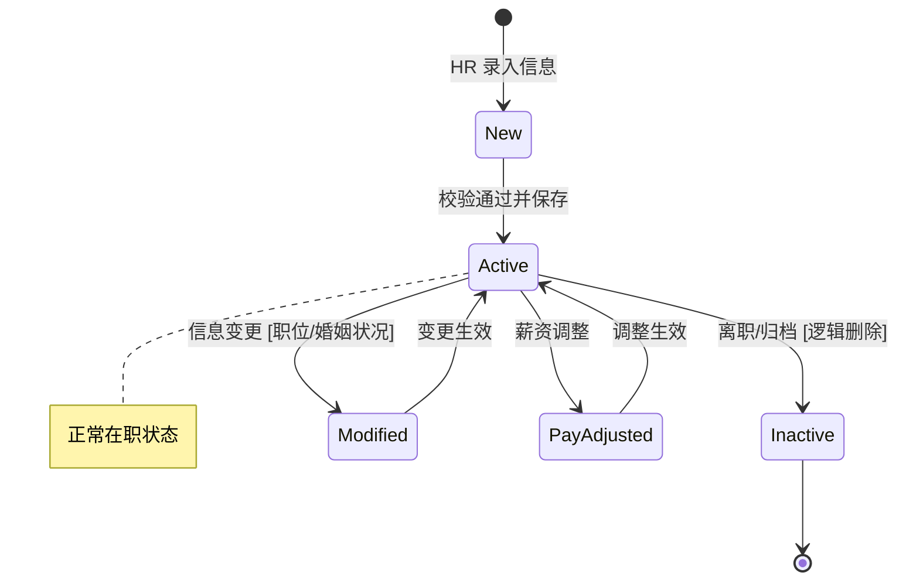

# 核心流程: 员工生命周期管理 (Employee Lifecycle)

## 1. 业务流程总览

本模块详细阐述了员工从"入职录入"到"信息变更"的全生命周期管理。

### 1.1 入职流程 (Onboarding Process)
这是业务的起点，确保新员工的基础数据准确无误地进入系统。

---

## 2. 员工信息变更流程 (Update Process)

随着员工在企业内的发展，其信息会不断发生变化（如晋升、婚姻状况变更等）。

### 2.1 变更操作逻辑

---

## 3. 员工状态模型 (Logical State Machine)

虽然底层数据库可能没有显式的 "状态字段"，但在业务逻辑层面，员工档案存在以下几种逻辑状态：

### 3.1 状态说明
*   **New (新建)**: 临时状态，指数据正在录入但尚未持久化。
*   **Active (在职/有效)**: 系统的主要稳态，员工可以被搜索、被查询。
*   **Modified (变更中)**: 当 HR 点击"编辑"但未保存时，系统需锁定或标记该状态以防冲突（取决于并发策略）。
*   **PayAdjusted (调薪)**: 触发了 `EmployeePayHistory` 的变更，属于特殊的子状态。
*   **Inactive (归档)**: 员工离职后，数据不物理删除，而是标记为无效，保留历史供查。
