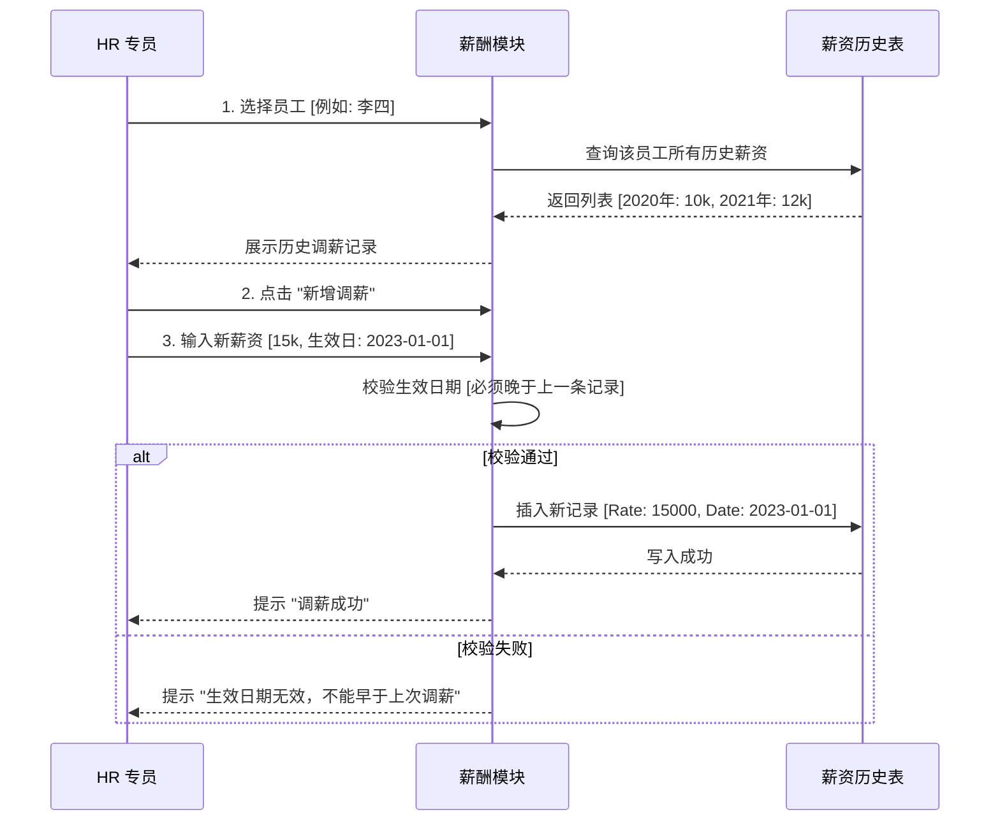

# 核心流程: 薪酬变更管理 (Compensation Management)

## 1. 业务痛点与解决方案

### 1.1 为什么要有独立的薪酬历史模块？
很多系统只是简单的在员工主表中加一个 `CurrentSalary` 字段，但这完全无法满足实际业务需求：
*   **无法回溯**：如果只记录当前工资，HR 无法回答 "张三去年这个时候工资是多少？"
*   **无法审计**：每一次调薪都需要有据可查（谁操作的？什么时候生效的？）。
*   **无法分析**：无法生成 "年度调薪幅度分析报告"。

本系统采用了 **主子表分离设计** 来解决这个问题。

---

## 2. 数据模型关系 (Data Relationship)

```mermaid
erDiagram
    EMPLOYEE ||--o{ PAY_HISTORY : 拥有多条

    EMPLOYEE {
        int EmployeeID PK
        string LoginID 登录名
        string JobTitle 职位
        date HireDate 入职日期
    }

    PAY_HISTORY {
        int EmployeeID FK
        datetime RateChangeDate 调薪日期
        decimal Rate 薪资费率
        tinyint PayFrequency 发薪频次
        datetime ModifiedDate 记录时间
    }
```

### 2.1 字段业务含义
*   **Rate (薪资费率)**: 小时薪或月薪的具体数值。
*   **PayFrequency (发薪频次)**: 1=月薪, 2=双周薪。
*   **RateChangeDate (生效日期)**: 此薪资标准开始执行的时间点。

---

## 3. 调薪业务流程 (Salary Adjustment Process)

当 HR 给员工调薪时，系统并不是直接修改旧数据，而是**新增一条记录**。



## 4. 关键业务规则
1.  **生效日期不可重叠**：同一员工在同一天只能有一条生效的薪资记录。
2.  **当前薪资认定**：系统默认取 `RateChangeDate` 最近的一条记录作为员工的"当前薪资"。
3.  **不可篡改性**：建议历史薪资记录一旦生成，仅允许特定权限的高级管理员修改（注：当前演示版可能开放了修改权限，但在正式生产环境应严格控制）。
