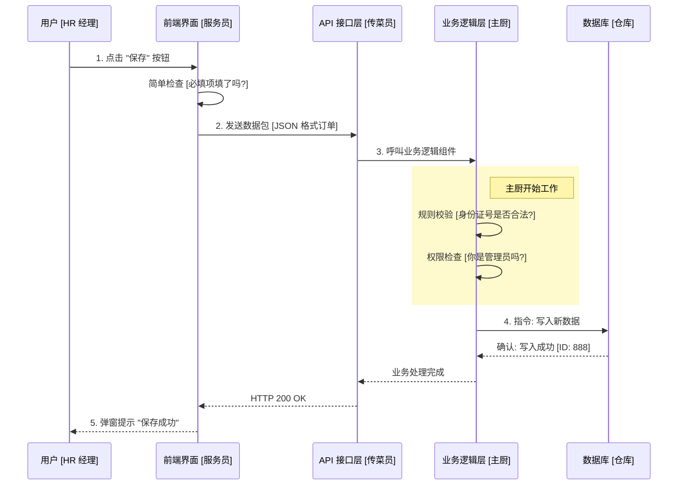

# 技术架构翻译 (Technical Translation for PM)

## 1. 我们的系统是如何工作的？ (The Restaurant Metaphor)

为了方便非技术人员理解，我们可以把这个系统想象成一家**高级餐厅**。

| 技术层级 | 餐厅对应角色 | 职责说明 |
| :--- | :--- | :--- |
| **Frontend (MVC/Web)** | **服务员 & 菜单** | 负责把精美的界面展示给用户，接收用户的指令（点菜），并把结果端上来。 |
| **Web API** | **传菜窗口** | 服务员和服务员不直接进厨房，而是通过这个窗口把单子递进去。它是前后端的桥梁。 |
| **Business Logic (BO)** | **主厨 (核心大脑)** | 拿到单子后，决定怎么做。比如："这道菜能不能做？"（校验规则），"少盐少油"（业务逻辑处理）。 |
| **Data Access (DAL)** | **配菜员** | 主厨不动手拿菜，而是指挥配菜员去仓库取。配菜员懂怎么最高效地拿取食材。 |
| **Database (SQL)** | **大仓库/冷库** | 所有食材（数据）最终存放的地方。 |

---

## 2. 一次"保存员工信息"的旅程

当您在界面上点击 **[保存]** 按钮时，后台发生了什么？

## 3. 常见术语速查 (Glossary)

*   **CRUD**: 增删改查 (Create, Read, Update, Delete)。这是最基础的数据操作，就像餐厅里的 "点菜、退菜、改菜、查单"。
*   **DTO (Data Transfer Object)**: 数据传输对象。就像是服务员手里的 "托盘"，专门用来端菜（传输数据），不负责做菜（处理逻辑）。
*   **Repository (仓储)**: 就像是 "货架管理员"，专门负责把数据整齐地放进数据库，或者快速地取出来。
*   **Dependency Injection (依赖注入)**: 就像是 "餐厅经理" 在上班前把主厨需要的刀具、配菜员都分配好，主厨来了直接用，不用自己去招人。这是为了让系统更灵活。

---

## 4. 为什么这样设计？ (Design Philosophy)

您可能会问：**"为什么要分这么多层？直接连数据库不行吗？"**

*   **安全性**: 不让前端直接接触数据库，就像不让客人直接进仓库乱翻。
*   **可维护性**: 如果想换个菜单（换前端），不用拆厨房（改后端逻辑）。
*   **复用性**: 如果将来要做个手机 App，可以直接用现有的 API 和业务逻辑，不用重写。
